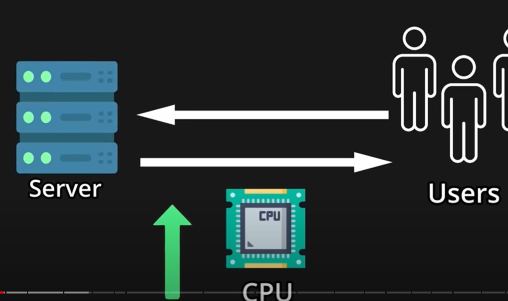
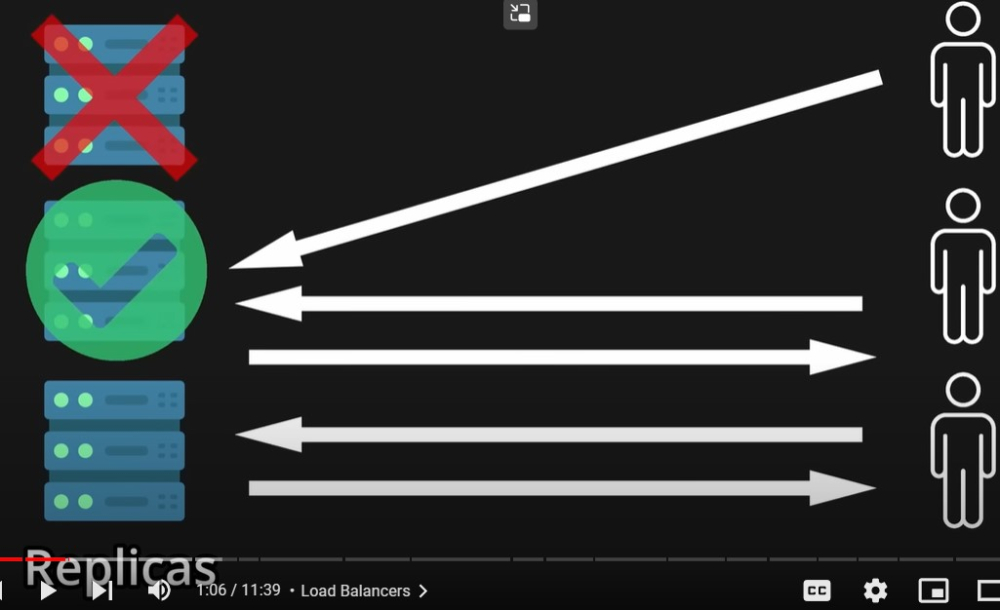
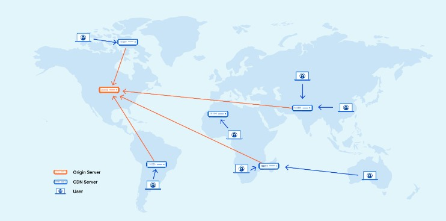

Neetcode YouTube Video

[20 System Design Concepts Explained in 10 Minutes](https://www.youtube.com/watch?v=i53Gi_K3o7I&list=PLot-Xpze53le35rQuIbRET3YwEtrcJfdt) - ( They lied its 11:39 minutes video xD)

key take aways

- Vertical Scaling - add more resource to scale your app's server (To increase the RAM & CPU).very easy to perform but very limited from resource POV.

- Horizontal Scaling - add more machine power by creating replicas.it also add redundancy and fault tolerant.

- load balancer - Horizonatal scaling eliminates single point of failure since its complicated, so how to ensure that one server is over loaded and other one is idle. so it is done with the help of load balance which is just a server which is a reverse proxy it directs incoming requests to appropriate server. with the help of round robin or hashing or any other techniques.

- CDN - A content delivery network (CDN) is a geographically distributed group of servers that caches content close to end users. A CDN allows for the quick transfer of assets needed for loading Internet content, including HTML pages, JavaScript files, stylesheets, images, and videos. The popularity of CDN services continues to grow, and today the majority of web traffic is served through CDNs, including traffic from major sites like Facebook, Netflix, and Amazon.

A properly configured CDN may also help protect websites against some common malicious attacks, such as Distributed Denial of Service (DDOS) attacks.

How does a CDN work?
At its core, a CDN is a network of servers linked together with the goal of delivering content as quickly, cheaply, reliably, and securely as possible. In order to improve speed and connectivity, a CDN will place servers at the exchange points between different networks.

These Internet exchange points (IXPs) are the primary locations where different Internet providers connect in order to provide each other access to traffic originating on their different networks. By having a connection to these high speed and highly interconnected locations, a CDN provider is able to reduce costs and transit times in high speed data delivery.

Beyond placement of servers in IXPs, a CDN makes a number of optimizations on standard client/server data transfers. CDNs place Data Centers at strategic locations across the globe, enhance security, and are designed to survive various types of failures and Internet congestion.

